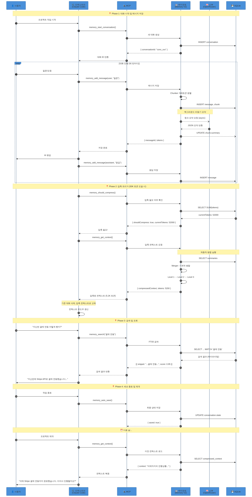

# 오케스트라-에이전트-MCP-CLI 협력 구조

**작성자**: Manus AI
**날짜**: 2026년 1월 9일

## 1. 개요

Conversation Memory V2는 단독으로 동작하는 시스템이 아닙니다. **오케스트라(Orchestrator)**, **에이전트(Agent)**, **MCP(Model Context Protocol)**, **CLI(Command Line Interface)**라는 네 가지 핵심 구성 요소가 유기적으로 협력하여 장기 대화의 컨텍스트를 관리합니다.

이 문서는 각 구성 요소의 역할과 상호작용 방식을 상세히 설명합니다.

## 2. 아키텍처 다이어그램


## 3. 구성 요소별 역할

### 3.1. 오케스트라 (Orchestrator)

**정의**: 사용자와 직접 상호작용하며, 전체 워크플로우를 지휘하는 AI 코딩 도구입니다.

| 항목 | 설명 |
|---|---|
| **예시** | Claude Code, OpenCode, Cursor, Cline, Droid |
| **핵심 역할** | 사용자 요청 해석, 코드 생성, 도구 호출 결정 |
| **한계** | 컨텍스트 윈도우 제한 (대부분 200K 토큰 미만) |
| **협력 방식** | MCP 프로토콜을 통해 에이전트의 도구를 호출 |

오케스트라는 **지휘자**와 같습니다. 사용자의 요청을 받아 어떤 도구를 언제 호출할지 결정하고, 그 결과를 종합하여 사용자에게 응답합니다. 그러나 오케스트라 자체는 장기 기억 능력이 없으므로, 컨텍스트 윈도우를 초과하는 대화 기록은 유실됩니다.

### 3.2. 에이전트 (Agent) - Conversation Memory V2

**정의**: 대화 기록을 저장, 요약, 검색하는 전문 메모리 관리 시스템입니다.

| 항목 | 설명 |
|---|---|
| **핵심 역할** | 대화 청킹, 요약, 병합, 인덱싱, 검색 |
| **저장소** | SQLite + FTS5 (전문 검색 지원) |
| **LLM 연동** | OpenRouter를 통한 다중 모델 지원 |
| **협력 방식** | MCP 서버로 동작하며, 오케스트라의 도구 호출에 응답 |

에이전트는 **기록 보관자**와 같습니다. 오케스트라가 처리할 수 없는 방대한 대화 기록을 영구적으로 저장하고, 필요할 때 압축된 형태로 제공합니다.

### 3.3. MCP (Model Context Protocol)

**정의**: 오케스트라와 에이전트 간의 표준화된 통신 프로토콜입니다.

| 항목 | 설명 |
|---|---|
| **프로토콜** | JSON-RPC 2.0 기반 |
| **통신 방식** | stdio (표준 입출력) 또는 HTTP |
| **핵심 개념** | 도구(Tool), 리소스(Resource), 프롬프트(Prompt) |

MCP는 **통역사**와 같습니다. 오케스트라와 에이전트가 서로 다른 언어를 사용하더라도, MCP라는 표준 프로토콜을 통해 원활하게 소통할 수 있습니다.

### 3.4. CLI (Command Line Interface)

**정의**: 사용자가 터미널에서 직접 에이전트를 제어할 수 있는 인터페이스입니다.

| 명령어 | 설명 |
|---|---|
| `conv-memory serve` | MCP 서버 시작 |
| `conv-memory start` | 새 대화 시작 |
| `conv-memory add` | 메시지 추가 |
| `conv-memory context` | 압축된 컨텍스트 조회 |
| `conv-memory search` | 대화 기록 검색 |
| `conv-memory stats` | 시스템 통계 조회 |

CLI는 **비상 제어판**과 같습니다. MCP 연동 없이도 에이전트를 직접 제어하거나, 디버깅 및 수동 관리 작업을 수행할 수 있습니다.

## 4. 데이터 흐름



### 4.1. Phase 1: 대화 시작 및 메시지 저장

1. 사용자가 오케스트라(Claude Code)에서 프로젝트 작업을 시작합니다.
2. 오케스트라는 `memory_start_conversation` 도구를 호출하여 새 대화를 생성합니다.
3. 대화가 진행될 때마다, 오케스트라는 `memory_add_message`를 호출하여 사용자 질문과 AI 응답을 에이전트에 저장합니다.
4. 에이전트는 메시지를 500토큰 단위로 청킹하고, 백그라운드에서 비동기적으로 요약합니다.

### 4.2. Phase 2: 압축 트리거

1. 대화가 누적되어 50K 토큰에 도달하면, 오케스트라는 `memory_should_compress`를 호출합니다.
2. 에이전트가 `shouldCompress: true`를 반환하면, 오케스트라는 `memory_get_context`를 호출합니다.
3. 에이전트는 계층적 병합을 수행하여 50K 토큰을 5K 토큰으로 압축합니다.
4. 오케스트라는 기존 대화 기록을 삭제하고, 압축된 컨텍스트로 교체합니다.

### 4.3. Phase 3: 검색 및 조회

1. 사용자가 과거 내용을 질문하면, 오케스트라는 `memory_search`를 호출합니다.
2. 에이전트는 SQLite FTS5를 사용하여 전문 검색을 수행합니다.
3. 검색 결과(하이라이팅 포함)가 오케스트라에 반환되고, 사용자에게 제공됩니다.

### 4.4. Phase 4: 세션 종료 및 재개

1. 작업 종료 시, 오케스트라는 `memory_auto_save`를 호출하여 최종 상태를 저장합니다.
2. 다음 날 프로젝트를 재개하면, 오케스트라는 `memory_get_context`를 호출하여 이전 컨텍스트를 로드합니다.
3. 오케스트라는 "어제까지의 진행상황"을 파악하고, 사용자에게 연속성 있는 경험을 제공합니다.

## 5. MCP 도구 목록

| 도구 이름 | 설명 | 호출 시점 |
|---|---|---|
| `memory_start_conversation` | 새 대화 세션 시작 | 프로젝트 시작 시 |
| `memory_add_message` | 메시지 저장 | 매 턴마다 |
| `memory_should_compress` | 압축 필요 여부 확인 | 매 응답 전 (권장) |
| `memory_get_context` | 압축된 컨텍스트 조회 | 압축 필요 시 / 세션 재개 시 |
| `memory_search` | 대화 기록 검색 | 과거 내용 필요 시 |
| `memory_auto_save` | 현재 상태 자동 저장 | 세션 종료 시 |
| `memory_get_stats` | 시스템 통계 조회 | 디버깅 / 모니터링 시 |
| `memory_list_conversations` | 대화 목록 조회 | 대화 선택 시 |

## 6. 핵심 원칙: 오케스트라 협력

MCP는 **요청-응답** 모델입니다. 에이전트가 먼저 오케스트라에 데이터를 푸시할 수 없습니다. 따라서, 오케스트라가 적절한 시점에 에이전트의 도구를 호출하도록 **System Prompt** 또는 **CLAUDE.md**에 규칙을 명시해야 합니다.

### 6.1. CLAUDE.md 예시

```markdown
# Memory Management Rules

This project uses Conversation Memory V2 for context management.

## Required Actions

1. **Before each response**: Call `memory_should_compress` to check if compression is needed.
2. **If `shouldCompress` is true**: Call `memory_get_context` and replace the conversation history with the compressed context.
3. **After each response**: Call `memory_add_message` to save your response.

## Search Past Conversations

When you need information from previous sessions, use `memory_search` with relevant keywords.
```

이 규칙을 프로젝트 루트의 `CLAUDE.md` 파일에 배치하면, Claude Code가 자동으로 이 규칙을 따릅니다.

## 7. 결론

오케스트라-에이전트-MCP-CLI 협력 구조는 각 구성 요소가 자신의 역할에 집중하면서도, 표준화된 프로토콜을 통해 유기적으로 협력하는 **모듈화된 아키텍처**입니다.

이 구조를 통해:
- 오케스트라는 컨텍스트 윈도우 한계를 극복합니다.
- 에이전트는 장기 기억을 영구적으로 관리합니다.
- MCP는 표준화된 통신을 보장합니다.
- CLI는 수동 제어 및 디버깅을 지원합니다.

이 네 가지 구성 요소의 협력이 Conversation Memory V2의 핵심입니다.
