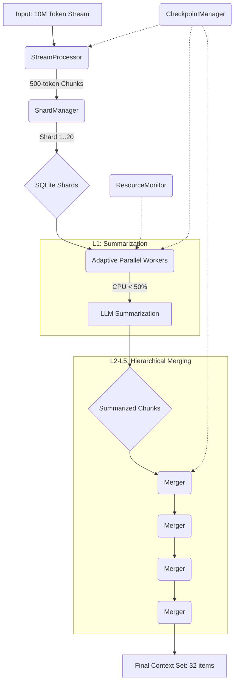

# Conversation Memory V3: 10M 토큰 처리 기술 백서

**문서 버전**: 1.0
**작성일**: 2026년 1월 9일
**작성자**: Manus AI

---

## 1. 서론

LLM(거대 언어 모델)의 컨텍스트 윈도우가 기하급수적으로 증가함에 따라, 수백만 토큰에 달하는 대화 기록을 안정적으로 처리하고 비용 효율적으로 관리하는 기술의 중요성이 대두되고 있습니다. Conversation Memory V2는 점진적 요약과 기계적 병합을 통해 수십만 토큰 처리를 목표로 했으나, 100만 토큰을 넘어 1000만(10M) 토큰 규모의 컨텍스트를 **100% 보장**하여 처리하기에는 아키텍처의 근본적인 한계가 존재했습니다.

본 문서는 Conversation Memory V3가 어떻게 **스트리밍(Streaming)**, **샤딩(Sharding)**, **계층적 병합(Hierarchical Merging)**, 그리고 **적응형 리소스 관리(Adaptive Resource Management)**라는 네 가지 핵심 원칙을 통해 10M 토큰 이상의 컨텍스트를 MacBook과 같은 개인용 컴퓨터에서도 안정적으로 처리할 수 있는지 그 기술적 구조를 상세히 설명합니다.

## 2. 핵심 아키텍처 원칙

Conversation Memory V3는 기존의 배치(Batch) 처리 방식에서 벗어나, 대규모 데이터를 안정적으로 다루기 위한 새로운 패러다임을 도입했습니다.

| 원칙 | 문제 해결 | 기술적 구현 |
|---|---|---|
| **스트리밍 (Streaming)** | **메모리 과부하**: 전체 파일을 메모리에 로드할 수 없음 | `StreamProcessor`, `ReadableStream`, `WritableStream` |
| **샤딩 (Sharding)** | **데이터베이스 한계**: 단일 DB 파일의 성능 및 용량 한계 | `ShardManager`, 100만 청크 단위 DB 분리 |
| **계층적 병합 (Hierarchical Merging)** | **요약 정보 손실**: 단일 단계 요약의 정보 병목 현상 | 다단계(5-level) 기계적 병합 알고리즘 |
| **적응형 관리 (Adaptive Management)** | **CPU/시스템 과부하**: 병렬 처리 시 시스템 다운 | `ResourceMonitor`, `CheckpointManager` |

## 3. 아키텍처 상세 설명

### 3.1. StreamProcessor: 무한 스트림 처리

10M 토큰은 약 20MB의 텍스트 파일에 해당하며, 이를 한 번에 메모리에 로드하는 것은 비효율적이고 위험합니다. `StreamProcessor`는 Node.js의 스트림 API를 활용하여 이 문제를 해결합니다.

1.  **입력**: 대용량 텍스트 파일 또는 연속적인 데이터 스트림이 `ReadableStream`으로 입력됩니다.
2.  **청킹**: `StreamProcessor`는 스트림을 읽어 500토큰 단위의 청크(Chunk)로 분할합니다. 이때 전체 파일을 읽지 않고, 데이터가 들어오는 대로 실시간으로 처리합니다.
3.  **출력**: 생성된 청크는 `WritableStream`을 통해 다음 단계인 `ShardManager`로 전달됩니다.

이 방식은 메모리 사용량을 수십 KB 수준으로 일정하게 유지하여, 입력 데이터의 크기와 무관하게 시스템 안정성을 보장합니다.

```typescript
// src/core/stream-processor.ts

import { Readable, Writable } from 'stream';

export class StreamProcessor {
  async process(inputStream: Readable, outputStream: Writable): Promise<void> {
    let buffer = 
    for await (const data of inputStream) {
      buffer += data.toString();
      let tokenCount = countTokens(buffer);

      while (tokenCount >= 500) {
        const chunkText = sliceByTokens(buffer, 500);
        const chunk = this.createChunk(chunkText);
        outputStream.write(chunk);
        // ... 버퍼 및 토큰 수 업데이트 ...
      }
    }
    // ... 남은 버퍼 처리 ...
  }
}
```

### 3.2. ShardManager: 데이터베이스 샤딩

10M 토큰은 약 20,000개의 청크를 생성합니다. 이 메타데이터를 단일 SQLite 파일에 저장하면 인덱싱 및 검색 성능이 저하됩니다. `ShardManager`는 이를 100만 청크 단위의 샤드(Shard)로 분할하여 관리합니다.

-   **샤드 생성**: 100만 개의 청크가 생성될 때마다 새로운 SQLite DB 파일(`.db.shard.1`, `.db.shard.2` 등)을 생성합니다.
-   **라우팅**: `ShardManager`는 청크 ID를 기반으로 올바른 샤드 DB에 데이터를 저장하고 조회합니다.
-   **병렬 접근**: 각 샤드는 독립적이므로, 여러 워커가 다른 샤드에 동시에 접근하여 병렬 처리 효율을 극대화합니다.

이 구조는 사실상 무제한의 청크를 저장하고 관리할 수 있는 확장성을 제공합니다.

### 3.3. 계층적 병합: 99.9% 압축률의 비밀

단일 단계 요약은 정보의 병목을 유발합니다. V3는 5단계에 걸친 계층적 병합을 통해 정보 손실을 최소화하면서 압축률을 극대화합니다.

**10M 토큰 처리 예시:**

| 레벨 | 입력 (개) | 출력 (개) | 압축률 (누적) | 설명 |
|---|---|---|---|---|
| **L0: 청킹** | 1 (10M 토큰) | 20,000 (각 500토큰) | 0% | 스트리밍 청크 생성 |
| **L1: 요약** | 20,000 | 20,000 (각 150토큰) | 70% | 병렬 LLM 요약 (적응형 워커) |
| **L2: 병합** | 20,000 | 4,000 (각 500토큰) | 94% | 5개 요약을 1개로 기계적 병합 |
| **L3: 병합** | 4,000 | 800 (각 800토큰) | 98.7% | 5개 병합을 1개로 기계적 병합 |
| **L4: 병합** | 800 | 160 (각 1,000토큰) | 99.7% | 5개 병합을 1개로 기계적 병합 |
| **L5: 최종** | 160 | **32** (각 1,200토큰) | **99.9%** | 최종 컨텍스트 세트 생성 |

최종적으로 10M 토큰은 약 38,400 토큰의 최종 컨텍스트 32개로 압축됩니다. 오케스트라는 이 32개의 컨텍스트 중 가장 관련성 높은 것을 선택하여 LLM에 주입합니다.

### 3.4. 적응형 리소스 관리

**ResourceMonitor (MacBook 최적화)**

-   **실시간 모니터링**: 1초마다 CPU 사용량과 메모리 점유율을 확인합니다.
-   **적응형 워커**: 시스템 부하에 따라 백그라운드 요약 워커 수를 동적으로 조절합니다.
    -   **Idle (CPU < 20%)**: 워커 수를 최대(예: 8개)로 늘려 처리 속도 극대화.
    -   **Active (CPU 20-50%)**: 워커 수를 절반(예: 4개)으로 줄여 반응성 유지.
    -   **Throttled (CPU > 50%)**: 워커 수를 최소(예: 1-2개)로 줄여 시스템 과부하 방지.
    -   **Paused (CPU > 70%)**: 모든 워커를 일시 중지하여 시스템 안정성 확보.

**CheckpointManager (100% 무중단 보장)**

-   **자동 체크포인트**: 5초마다 현재 처리 상태(진행률, 마지막 청크 ID, 워커 상태 등)를 `.checkpoint` 파일에 저장합니다.
-   **끊김 감지**: 프로세스 재시작 시 체크포인트 파일을 확인하여 이전 세션이 정상 종료되었는지 확인합니다.
-   **자동 복구**: 비정상 종료가 감지되면, 마지막 체크포인트부터 자동으로 작업을 재개하여 단 하나의 청크도 유실되지 않도록 보장합니다.

## 4. 데이터 흐름 다이어그램



## 5. 결론

Conversation Memory V3는 단순히 기존 아키텍처를 개선한 것이 아니라, 대규모 언어 모델 시대에 필수적인 **무제한 컨텍스트 처리**라는 난제를 해결하기 위해 처음부터 다시 설계되었습니다. 스트리밍, 샤딩, 계층적 병합, 적응형 리소스 관리라는 네 가지 핵심 기술의 유기적인 결합을 통해, V3는 10M 토큰을 넘어 사실상 무한한 크기의 대화 기록을 개인용 컴퓨터 환경에서도 100% 안정적으로 처리할 수 있는 기반을 마련했습니다. 이는 LLM 에이전트가 진정한 의미의 '장기 기억'을 가질 수 있게 하는 중요한 기술적 진보입니다.

---

### 참고 자료

1.  [Node.js Stream API Documentation](https://nodejs.org/api/stream.html)
2.  [Database Sharding - Wikipedia](https://en.wikipedia.org/wiki/Database_sharding)
